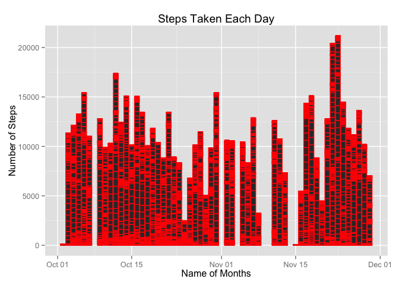
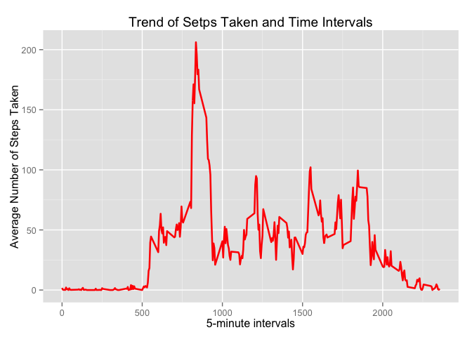
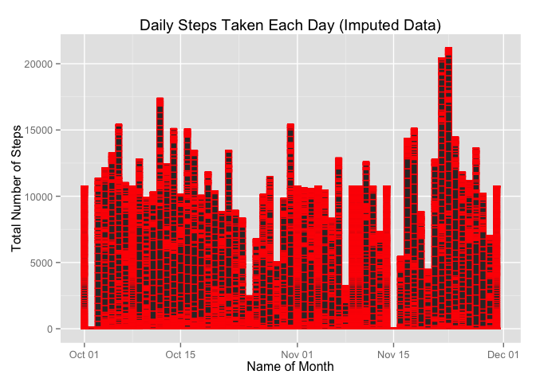
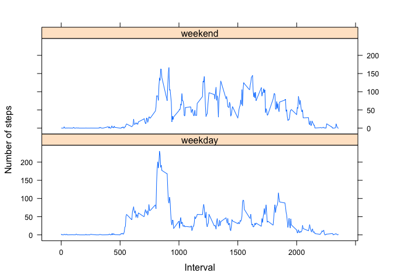

# Reproducible Research: Peer Assessment 1


## Loading and preprocessing the data from csv file format

```r
library(ggplot2)
```

```
## Warning: package 'ggplot2' was built under R version 3.1.3
```

```r
data <- read.table('activity.csv',sep = ",",header = TRUE, na.strings ="NA",colClasses = c('integer','Date','factor'))

# missing value has been treated and
new.data <- na.omit(data)
```


## What is mean total number of steps taken per day?


```r
# Calculated the total number of steps taken per day
total.steps <- tapply(new.data$steps, new.data$date, FUN = sum)

# making a histogram 
p1 <- ggplot(new.data, aes(date, steps)) + geom_bar(stat = "identity",binwidth = .5, col = "red") + labs(title = "Steps Taken Each Day",x = "Name of Months", y = "Number of Steps")
print(p1)
```

 

```r
# calculated mean and median value by following Number of steps per day
mean(total.steps)
```

```
## [1] 10766.19
```

```r
median(total.steps)
```

```
## [1] 10765
```


## What is the average daily activity pattern?

```r
averages <- aggregate(new.data$steps, list(interval = as.numeric(as.character(new.data$interval))), FUN = "mean")
names(averages)[2] <- "Avg.Steps"

p2 <- ggplot(averages, aes(interval, Avg.Steps)) + geom_line(color = "red", size = 0.9) + labs(title = "Trend of Setps Taken and Time Intervals", x = "5-minute intervals", y = "Average Number of Steps Taken")
print(p2)
```

 


## Imputing missing values


```r
averages[averages$Avg.Steps == max(averages$Avg.Steps),]
```

```
##     interval Avg.Steps
## 104      835  206.1698
```

```r
sum(!complete.cases(data))
```

```
## [1] 2304
```


```r
impData <- data 
for (i in 1:nrow(impData)) {
    if (is.na(impData$steps[i])) {
        impData$steps[i] <- averages[which(impData$interval[i]
        == averages$interval), ]$Avg.Steps
    }
}
```


```r
sum(!complete.cases(impData))
```

```
## [1] 0
```

```r
p3 <- ggplot(impData, aes(date, steps)) + geom_bar(stat = "identity",binwidth = .5, col = "red") + labs(title = "Daily Steps Taken Each Day (Imputed Data)",x = "Name of Month", y = "Total Number of Steps")
print(p3)
```

 


```r
total.steps.impute <- tapply(impData$steps, impData$date, FUN = sum)
mean(total.steps.impute)
```

```
## [1] 10766.19
```

```r
median(total.steps.impute)
```

```
## [1] 10766.19
```


## Are there differences in activity patterns between weekdays and weekends?

```r
impData$weekdays <- factor(format(impData$date, "%A"))
levels(impData$weekdays)
```

```
## [1] "Friday"    "Monday"    "Saturday"  "Sunday"    "Thursday"  "Tuesday"  
## [7] "Wednesday"
```

```r
levels(impData$weekdays) <- list(weekday = c("Monday", "Tuesday","Wednesday", "Thursday", "Friday"), weekend = c("Saturday", "Sunday"))
levels(impData$weekdays)
```

```
## [1] "weekday" "weekend"
```

```r
table(impData$weekdays)
```

```
## 
## weekday weekend 
##   12960    4608
```

```r
new.averages <- aggregate(impData$steps,list(interval = as.numeric(as.character(impData$interval)), weekdays = impData$weekdays), FUN = "mean")
names(new.averages)[3] <- "meanOfSteps"

# loading lattice package and making plot

library(lattice)
```

```
## Warning: package 'lattice' was built under R version 3.1.3
```

```r
p4 <- xyplot(new.averages$meanOfSteps ~ new.averages$interval | new.averages$weekdays, layout = c(1, 2), type = "l", xlab = "Interval", ylab = "Number of steps")
print(p4)
```

 

